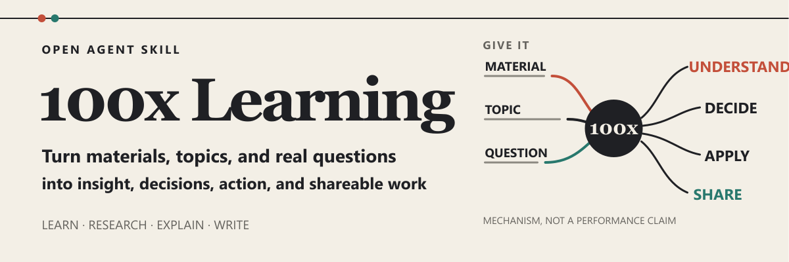

<p align="center">
  
</p>

<!-- readme-header:start -->

<p align="center">
  <a href="./README.md">中文</a> · <strong>English</strong> · <a href="./README.ja.md">日本語</a> | <a href="./SKILL.md">文档</a> | <a href="./CONTRIBUTING.md">贡献</a> | <a href="https://github.com/CheshireMew/100x-learning/issues">反馈</a>
</p>

<p align="center">
  <a href="https://x.com/0xCheshire" title="X"></a>
  <a href="https://t.me/CheshireBTC" title="Telegram"></a>
  <a href="https://blog.blacknico.com/" title="Blog"></a>
  <a href="https://blacknico.com/" title="Homepage"></a>
</p>

<p align="center">
  <a href="https://github.com/CheshireMew/100x-learning/stargazers"></a>
  <a href="https://github.com/CheshireMew/100x-learning/forks"></a>
  <a href="https://github.com/CheshireMew/100x-learning/blob/main/LICENSING.md"></a>
</p>

<!-- readme-header:end -->

# 100x Learning

Give your Agent a source, an unfamiliar topic, or a real problem. Get something you can understand, evaluate, apply, or share now. When the work is ongoing, 100x Learning can also use real feedback to maintain the next lesson, topic, or content experiment.

`100x-learning` is a learning and content Skill built to the open [Agent Skills specification](https://agentskills.io/specification). It reads subtitles, articles, links, topics, claims, projects, drafts, and post-publication feedback, then chooses the workflow that matches the requested result.

Those workflows cover source comprehension, research, explanation, practice, content review, writing, ongoing topic selection, and knowledge capture. The Skill is not a standalone application or tied to one Agent host, and the hero explains a mechanism rather than claiming a 100x performance effect.

## What you can ask for

### Learning and research

- **Understand a source**: `Read this interview, explain its main thread, and mark the passages worth revisiting.` → Structure, key relationships, important points, and their real locations.
- **Choose how to learn**: `I want to learn X, but I am stuck at Y. How should I proceed?` → A learning path and practice method matched to the current goal and obstacle.
- **Research or verify a topic**: `Research X and compare whether A or B better fits my goal.` → Relevant sources, a reasoned judgment, and what remains unknown.
- **Explain or apply a concept**: `Explain X through a real scenario, then use it to analyze Y.` → A sufficient explanation, mechanism, example, and usable judgment.

### Continuous learning and content

- **Learn a topic continuously**: `Teach me X over multiple rounds. Complete the most useful lesson now, then use my feedback to choose the next one.` → A useful current lesson and a next step based on real feedback.
- **Maintain a long-term content direction**: `Build a long-term direction from my goals and existing work, then select topics worth pursuing this week.` → A content direction, durable topic state, and links to the relevant knowledge sources—without score-based quota filling.
- **Review published work**: `Review this post using the final copy, the last seven days of metrics, and the comments.` → Separate observations, candidate explanations, alternatives, and the next test.

### Review, writing, and the knowledge library

- **Review an existing draft**: `Check facts, structure, and AI-sounding language only. Do not rewrite it.` → Problems, impact, and revision direction; review stops before editing unless authorized.
- **Write publishable content**: `Turn these materials into a Chinese thread for general readers.` → A ready-to-use post, thread, GitHub project introduction, or article.
- **Design launch content**: `Design the launch content for this project. Give me the plan first.` → A normal content plan; benefits, dates, and action links are verified only when the copy actually contains them.
- **Use a private knowledge library**: `Save the confirmed conclusions to my private knowledge library.` → The unique library root is resolved first, then the existing topic source of truth is updated; files change only when explicitly requested.

Different results stop at different points. A request for candidates does not silently become a post, and a review does not silently edit the draft. A promotional request that asks for copy receives finished copy directly; it stops at a plan only when the user explicitly asks for a plan. Saving files, producing media, and publishing are separate actions.

## Quick start

Place the complete repository in a Skills directory read by your compatible tool. Tools that support project-level `.agents/skills/` can use:

```bash
git clone https://github.com/CheshireMew/100x-learning.git .agents/skills/100x-learning
```

If your tool uses a user-level directory or another location, replace the destination with that tool's Skills directory. Agent Skills is an open format; discovery paths and explicit invocation syntax are host-specific. The [official quickstart](https://agentskills.io/skill-creation/quickstart) shows the project-level layout.

After installation, describe the result directly:

```text
Read this material. First explain the content, main thread, and key relationships faithfully.
Then tell me which parts are most worth investigating further.
```

Hosts that support explicit Skill names can also use `$100x-learning`. The first successful result should be a clear explanation of the source itself—not generic study advice or an account of the internal workflow.

## From one task to the next round

A one-off task does not require a system. When the available material is sufficient, the Skill completes the explanation, research, judgment, or writing and stops. It uses the private knowledge library for cross-task state only when you explicitly ask for continuous learning, long-term content direction, durable topic management, or saved results.

Ongoing work follows one feedback chain: lock the real input and artifact for the current round, read metrics, comments, actual use, or your direct feedback, and then choose the next lesson, topic, or experiment. One publication result remains a hypothesis; it does not automatically rewrite long-term strategy, personal voice, or knowledge.

```text
Use $100x-learning to maintain the topic portfolio for this series.
Read the confirmed content direction and existing topics, then select the next batch for this week.
Do not score topics to fill a quota, and do not turn a temporary request into long-term strategy.
```

## How a task is handled

`SKILL.md` is the single entry point. It routes by the result the user wants and loads only the corresponding method from `references/`. Source comprehension, research, writing, durable topic selection, and publication review use distinct workflows.

The active routes stay separate:

- Research establishes facts and keeps relevant unknowns visible.
- Every publishable draft first serves communication: readers should quickly know what it is about, why it is worth continuing, and what they should understand, remember, or do. The task contract contains only the requested artifact and that communication result; numbers, rules, and fields from source material remain writing material instead of becoming additional content goals. A clear object or change can be stated directly; short copy completes one idea quickly, while articles and newsletters keep every section advancing the same center. New writing, expansion, and substantive restructuring search only for scenes, mechanisms, comparisons, reactions, and natural language missing from the user's material; they do not re-check supplied numbers, dates, conditions, or conclusions. Claims introduced by the writer or external material are verified only after a draft exists. These routes also resolve the private library first, select complete examples by the current public action and progression before narrowing by topic, read opening hooks that actually shape the draft, and always expose the task contract, material actually used, complete draft, creative references, and information sources in the delivery.
- Publication review uses the real artifact and feedback to define the next testable improvement.

Launch, recruitment, pre-launch, and promotional copy still use the normal writing flow. Benefits, dates, action links, or disclosure requirements are added only when ordinary readers need them to understand the main benefit or complete the next step.

Not every task is forced through writing. Source comprehension stops at explanation, research retains sources and unknowns, and a review does not edit the draft. One-off topic selection does not silently become a long-running project. Initializing a knowledge library, saving files, producing media, and publishing all require explicit requests.

## Private knowledge library and public repository

The private knowledge library lives outside the Skill directory and is not distributed with the public repository. You can initialize a new library or adopt an existing Markdown library that meets the directory contract:

```text
Use $100x-learning to initialize my private knowledge library at D:\Knowledge\100x-learning.
Use $100x-learning to adopt my existing private knowledge library at E:\Knowledge\Existing Library.
```

The underlying maintenance commands are:

```powershell
python scripts/private_library.py init --root "D:\Knowledge\100x-learning"
python scripts/private_library.py adopt --root "E:\Knowledge\Existing Library"
python scripts/private_library.py show
python scripts/private_library.py validate
```

The selected root is recorded in `~/.100x-learning/config.json`. A new library must live outside the Skill source directory. `init` will not overwrite a non-empty directory.

`adopt` adds the 100x Learning marker and updates the local root pointer without moving, copying, or rewriting existing knowledge. The config stores the library version and root path, not private content.

Once connected, the library can provide knowledge sources of truth, complete content examples, independent hooks, confirmed writing voice, publication history, long-term content direction, and durable topic state. Without a configured library, source comprehension and standalone research can still use the current input and external sources, but new writing, expansion, and substantive restructuring stop before any web or external-material discovery and tell the user to initialize or adopt a library. Only word-level, formatting, or meaning-preserving compression of a user-owned draft can continue as a local edit.

| Material role | Private-library destination | Result |
| --- | --- | --- |
| Original web pages, courses, subtitles, interviews, or posts | `20-Sources` | Source, role, and necessary context are retained; full text is saved only when needed and allowed |
| Digested concepts, mechanisms, conclusions, and boundaries | `10-Knowledge` | Existing topics and aliases are searched first; one topic keeps one source of truth |
| A complete piece worth using as a writing reference | Complete short-form or article case directories | The full artifact and verifiable source are stored and indexed |
| An original opening explicitly selected by the user | `20-Sources/Hook Library/<writing format>` | The continuous original passage, its continuation, source, and minimum locator are indexed separately |
| A confirmed final or published work | `40-Outputs/Writing` | The final copy is saved; publication history or voice is updated only when the evidence qualifies |

Long-term content direction and personal voice use separate sources of truth. A topic portfolio stores only the decision state for its series. Publication reviews link the final artifact and real feedback instead of copying another body or metric database.

Only repeated evidence, direct behavioral evidence, or user confirmation can update long-term sources of truth.

Cloning the public repository does not include private material or inherit another person's experience, opinions, or writing voice. The repository ships the workflow, methods, initialization templates, maintenance scripts, and behavior tests.

## Repository structure

```text
100x-learning/
├── SKILL.md                   # Main routing, behavior boundaries, and delivery rules
├── agents/openai.yaml         # Presentation and default prompt for OpenAI hosts
├── references/                # Learning, research, writing, and knowledge-library methods
├── scripts/                   # Subtitle, private-library, case, hook, and writing-memory tools
├── assets/private-library/    # Public templates used to initialize a private library
├── assets/readme/             # GitHub README visuals
├── tests/                     # Routing, capability-conservation, and resource-boundary tests
└── archive/                   # Retired material; never loaded by the active runtime
```

Active behavior is defined by `SKILL.md`, current references, scripts, public assets, metadata, and tests. `agents/openai.yaml` adapts display in one host; it does not change the repository's identity as a general Agent Skill. Retired routes and scripts in `archive/` do not remain as compatibility paths.

## Maintenance and verification

Maintenance scripts use the Python standard library. Run the complete behavior suite with:

```bash
python -m unittest discover -s tests -v
```

Normalize SRT, VTT, or timestamped text into Markdown while preserving real time boundaries:

```bash
python scripts/normalize_subtitles.py path/to/input.srt > normalized.md
```

With a configured private library, rebuild and validate content cases and writing memory:

```bash
python scripts/content_case_library.py build-index
python scripts/content_case_library.py validate
python scripts/writing_memory.py build-index
python scripts/writing_memory.py validate
```

The tests cover the real producer-to-consumer chain: a library is initialized from an empty directory and rediscovered by another process; real UTF-8 material is written through the official case and hook commands; each index is rebuilt and read through its supported entry point. Consumer-side fake indexes do not stand in for producer output.

## Scope

This Skill covers source comprehension, topic research, concept explanation, practice design, content review, short posts, threads, GitHub project introductions, articles, and content that must carry verified launch facts.

Image, GIF, video, audio, and podcast production; general translation; ad buying; sales pages; email sequences; full brand or marketing strategy; and publishing itself belong to separate capabilities.

Writing a file, producing media, uploading, and publishing are different actions. Without explicit authorization, results remain in the current response or local workspace.

## License

Original Skill instructions, source code, tests, scripts, and reusable templates are licensed under the [Mozilla Public License 2.0](./LICENSE). `archive/`, `output/`, imported cases, source articles, social posts, screenshots, and other third-party or reference material are outside that grant. See [LICENSING.md](./LICENSING.md) for the exact scope.

## Star History

<picture>
  <source media="(prefers-color-scheme: dark)" srcset="https://raw.githubusercontent.com/CheshireMew/100x-learning/star-history/star-history-dark.svg">
  <source media="(prefers-color-scheme: light)" srcset="https://raw.githubusercontent.com/CheshireMew/100x-learning/star-history/star-history.svg">
  
</picture>
