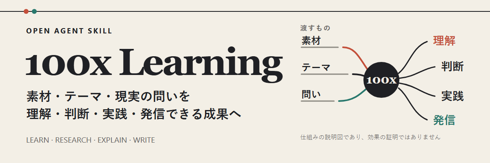

<!-- readme-header:start -->

<p align="center">
  
</p>

<h1 align="center">100x Learning</h1>

<p align="center">
  <strong>素材・テーマ・現実の問題を、理解・判断・活用・共有できる成果に変えます。</strong>
</p>

<p align="center">
  <a href="./README.md">中文</a> · <a href="./README.en.md">English</a> · <strong>日本語</strong> | <a href="./SKILL.md">文档</a> | <a href="./CONTRIBUTING.md">贡献</a> | <a href="https://github.com/CheshireMew/100x-learning/issues">反馈</a>
</p>

<p align="center">
  <a href="https://x.com/0xCheshire" title="X"></a>
  <a href="https://t.me/CheshireBTC" title="Telegram"></a>
  <a href="https://blog.blacknico.com/" title="Blog"></a>
  <a href="https://blacknico.com/" title="Homepage"></a>
</p>

<p align="center">
  <a href="https://github.com/CheshireMew/100x-learning/stargazers"></a>
  <a href="https://github.com/CheshireMew/100x-learning/forks"></a>
  <a href="https://github.com/CheshireMew/100x-learning/blob/main/LICENSING.md"></a>
</p>

<!-- readme-header:end -->

`100x-learning` は、オープンな [Agent Skills 仕様](https://agentskills.io/specification)に準拠した学習・コンテンツ Skill です。字幕、記事、リンク、テーマ、プロジェクト、下書き、公開後の反応を読み取り、求められた最終結果に合う方法を選びます。

<p align="center">
  
</p>

## まず欲しい成果を伝える

内部フローを選ぶ必要はありません。欲しい成果をそのまま伝えてください。

- **素材を理解する**：`このインタビューの流れと重要な関係を説明し、見返す価値が高い箇所も示してください。`
- **調査して判断する**：`X を調査し、私の目的には A と B のどちらが合うか比較し、まだ分からない点も残してください。`
- **説明して応用する**：`実際の場面で X を説明し、それを使って私が直面している Y を分析してください。`
- **レビューまたは執筆する**：`事実、構成、AI らしい表現だけを確認し、書き直さないでください。` または `この素材を一般読者向けの Thread にしてください。`
- **継続して学び、改善する**：`X を継続して学びます。今回は最も役立つ一課を終え、私の反応から次を決めてください。`
- **知識を残す**：`確認済みの結論を個人知識ライブラリに保存し、同じテーマの既存の正本を更新してください。`

Skill は指定された成果で停止します。レビューが勝手に書き直しへ進むことも、候補が投稿文へ変わることも、一度のテーマ選定が長期プロジェクトになることもありません。ファイル保存、メディア制作、アップロード、公開もそれぞれ独立した操作です。

## クイックスタート

互換 Agent が読み取る Skills ディレクトリに、リポジトリ全体を配置します。プロジェクト単位の `.agents/skills/` に対応するツールでは、次のように導入できます。

```bash
git clone https://github.com/CheshireMew/100x-learning.git .agents/skills/100x-learning
```

ツールがユーザー単位または別の場所を使う場合は、保存先をその Skills ディレクトリに置き換えてください。検出先と明示的な呼び出し構文はホストごとに異なります。[公式クイックスタート](https://agentskills.io/skill-creation/quickstart)にはプロジェクト単位の例があります。

導入後は、欲しい成果をそのまま伝えます。

```text
この素材を読んでください。まず内容、主な流れ、重要な関係を忠実に説明し、
そのうえで、さらに掘り下げる価値が高い箇所を教えてください。
```

Skill 名の明示呼び出しに対応するホストでは `$100x-learning` も使えます。最初に得られるべき成果は、一般的な勉強法や内部処理の説明ではなく、素材そのものを明快に理解できる説明です。

## 成果からずれない仕組み

| 依頼 | Skill の処理 | 成果と停止位置 |
| --- | --- | --- |
| 素材を理解する | 内容、流れ、関係、実際の位置を忠実に復元する | 明快な説明と重要箇所。調査プロジェクトには広げない |
| 調査・検証する | 情報源を比較し、事実、判断、未知の点を分ける | 出典付きの結論と、まだ確認が必要な問い |
| 内容をレビューする | 事実、構成、表現、指定された問題を確認する | 問題と修正方針。原稿は勝手に変更しない |
| 文章を書く | 提供された素材を整理し、必要なら Web で補足して直接執筆する | 使える短文、Thread、GitHub プロジェクト紹介、記事 |
| 継続学習・結果レビュー | 今回の実際の成果物、反応、結果を読む | 次の一課、テーマ、検証可能な改善 |

執筆時の Web 補足は、役立つ材料を増やすためのものです。すべての主張を自動で事実確認するわけではありません。調査、情報源の比較、事実確認そのものが必要な場合は、明示的に依頼してください。通常モードでは素材が十分なら完成稿まで直接進みます。ホストが Plan モードを提供する場合は、深いインタビューにも使えます。Skill は先に自力で取得できる情報を補い、その後で本人にしか答えられない経験、感情、立場、公開範囲を尋ねます。

単発の依頼に永続的な仕組みは不要です。継続学習、長期的なコンテンツ方向、成果の保存、個人の文体を明示的に求めた場合だけ、対応する継続資料を利用します。

## 任意：個人知識ライブラリと継続作業

個人知識ライブラリは Skill ディレクトリの外に置かれ、公開リポジトリには含まれません。Agent に新しいライブラリの初期化、または既存の Markdown ライブラリの接続を依頼できます。

```text
$100x-learning を使って D:\Knowledge\100x-learning に個人知識ライブラリを作成してください。
$100x-learning を使って E:\Knowledge\Existing Library の既存ライブラリを接続してください。
```

選択されたルートは `~/.100x-learning/config.json` に記録されます。設定が保存するのはライブラリのバージョンとパスだけで、個人の本文ではありません。`init` は中身のあるディレクトリを上書きしません。`adopt` はプロジェクトの識別情報とローカル参照だけを追加し、既存の知識を移動・書き換えません。

接続後は、原資料、テーマごとの一つの正本、完全な執筆事例、独立した書き出し、確認済みの作品、コンテンツ方向、継続テーマの状態を保存できます。通常の執筆では、まず原資料を読んでいない人にもすぐ理解できる具体的な角度を選び、その後でリポジトリに分けて保存されたフック、承接、本文、接続、結び、長文セクションから実際に必要なものだけを選びます。完成稿の後には、使ったテンプレートと未使用の任意部分を表示します。個人ライブラリが利用できる場合、取例ツールは候補タイトルを先に一覧表示します。モデルは同じコンポーネントについて、なお関連しそうな完全な事例を複数読んで比較してから、そのうち一つを採用するかどうか決められます。自動選択は行いません。事例は表現を助けても、本稿の事実にはなりません。通常の執筆ではテーマ知識、個人の文体、公開履歴を読みません。これらは対応する作業を明示的に求めた場合だけ利用します。一度の公開結果が長期戦略や個人の文体を自動で書き換えることもありません。

<details>
<summary>知識ライブラリの保守スクリプトを直接実行する</summary>

```powershell
python scripts/private_library.py init --root "D:\Knowledge\100x-learning"
python scripts/private_library.py adopt --root "E:\Knowledge\Existing Library"
python scripts/private_library.py show
python scripts/private_library.py validate
```

</details>

個人ライブラリが未設定でも、素材理解、調査、レビュー、執筆は現在の入力から続行できます。公開リポジトリを clone しても個人資料は含まれません。

## 対象範囲

この Skill は、素材理解、テーマ調査、概念説明、実践設計、コンテンツレビュー、短文、Thread、GitHub プロジェクト紹介、記事を扱います。画像、GIF、動画、音声、Podcast の制作、一般翻訳、広告運用、セールスページ、メール施策、ブランド全体やマーケティング全体の戦略、実際の公開は別の能力です。

ファイルへの書き込み、メディア制作、アップロード、公開は互いに別の操作です。明示的な許可がなければ、成果は現在の応答またはローカル作業領域に留まります。

## リポジトリ構成と保守

```text
100x-learning/
├── SKILL.md                   # 全体ルーティング、行動境界、成果ルール
├── agents/openai.yaml         # OpenAI ホストでの表示と既定プロンプト
├── references/                # 学習、調査、執筆、知識ライブラリの方法
├── scripts/                   # 字幕、個人ライブラリ、事例、書き出し、執筆記憶のツール
├── assets/private-library/    # 個人ライブラリ初期化用の公開テンプレート
├── assets/readme/             # GitHub README の画像
├── tests/                     # 動作、生成側から利用側までの経路、リソース境界のテスト
└── archive/                   # 廃止済み資料。現在の実行では読み込まない
```

`SKILL.md` が唯一の入口で、`references/` が専門的な方法を、`scripts/` が決定的な保守操作を担当します。`agents/openai.yaml` は一つのホスト向けの表示設定であり、汎用 Agent Skill というプロジェクトの性質は変えません。`archive/` の旧経路は現在の実行に参加しません。

保守スクリプトは Python 標準ライブラリを使用します。全行動テストを実行するには次を使います。

```bash
python -m unittest discover -s tests -v
```

コントリビューションの前に [CONTRIBUTING.md](./CONTRIBUTING.md) を確認してください。動作の詳細、スクリプトの入口、専門的な方法は [SKILL.md](./SKILL.md) と活動中の reference が正本です。README に内部ルールの複製は置きません。

## Star History

<picture>
  <source media="(prefers-color-scheme: dark)" srcset="https://raw.githubusercontent.com/CheshireMew/100x-learning/star-history/star-history-dark.svg">
  <source media="(prefers-color-scheme: light)" srcset="https://raw.githubusercontent.com/CheshireMew/100x-learning/star-history/star-history.svg">
  
</picture>

## ライセンス

オリジナルの Skill 指示、ソースコード、テスト、スクリプト、再利用可能なテンプレートは [Mozilla Public License 2.0](./LICENSE) で提供されます。`archive/`、`output/`、取り込まれた事例、出典記事、ソーシャル投稿、スクリーンショット、その他の第三者・参考資料はこの許諾の対象外です。正確な範囲は [LICENSING.md](./LICENSING.md) を参照してください。
