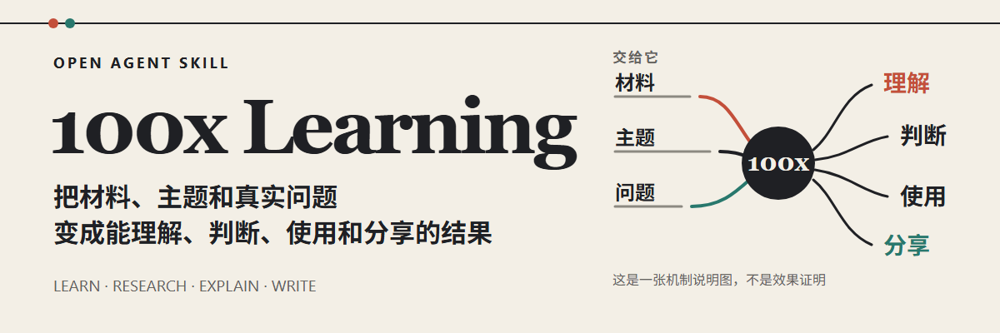

<!-- readme-header:start -->

<p align="center">
  
</p>

<h1 align="center">100x Learning</h1>

<p align="center">
  <strong>把材料、主题和真实问题变成能理解、判断、使用或分享的结果。</strong>
</p>

<p align="center">
  <strong>中文</strong> · <a href="./README.en.md">English</a> · <a href="./README.ja.md">日本語</a> | <a href="./SKILL.md">文档</a> | <a href="./CONTRIBUTING.md">贡献</a> | <a href="https://github.com/CheshireMew/100x-learning/issues">反馈</a>
</p>

<p align="center">
  <a href="https://x.com/0xCheshire" title="X"></a>
  <a href="https://t.me/CheshireBTC" title="Telegram"></a>
  <a href="https://blog.blacknico.com/" title="Blog"></a>
  <a href="https://blacknico.com/" title="Homepage"></a>
</p>

<p align="center">
  <a href="https://github.com/CheshireMew/100x-learning/stargazers"></a>
  <a href="https://github.com/CheshireMew/100x-learning/forks"></a>
  <a href="https://github.com/CheshireMew/100x-learning/blob/main/LICENSING.md"></a>
</p>

<!-- readme-header:end -->

`100x-learning` 是一个遵循 [Agent Skills 开放格式](https://agentskills.io/specification)的学习与内容 Skill。它能读取字幕、文章、链接、主题、项目、草稿和发布反馈，再按你要的最终结果选择合适的方法。

<p align="center">
  
</p>

## 先告诉它你要什么

你不需要先理解内部流程，直接描述结果即可：

- **读懂材料**：`讲清这份访谈的主线、关键关系，并标出值得回看的片段。`
- **整理字幕并讲解**：`去掉这份自动字幕里的广告和主题无关插入，校正并整理成保留原话的文章式全文，讲清材料并写入私人知识库。`
- **研究与判断**：`研究 X，比较 A 和 B 哪个更适合我的目标，并保留未知项。`
- **解释与实践**：`用真实场景讲清 X，再用它分析我遇到的 Y。`
- **审查或写作**：`只检查这篇稿子的事实、结构和 AI 味，不要改稿。` 或 `把这些材料写成面向普通读者的中文 Thread。`
- **连续学习与内容改进**：`围绕 X 连续学习，先完成当前最有用的一课，再根据我的反馈决定下一步。`
- **沉淀知识**：`把确认后的结论保存到我的私人知识库，并更新同主题的现有真源。`

Skill 会停在你指定的结果：审查不会自动改稿，候选不会自动扩写成帖子，一次选题不会变成长线项目。保存文件、制作媒体、上传和发布也都是独立动作。

## 快速开始

把完整仓库放进兼容 Agent 读取的 Skills 目录。支持项目级 `.agents/skills/` 的工具可以直接运行：

```bash
git clone https://github.com/CheshireMew/100x-learning.git .agents/skills/100x-learning
```

如果你的工具使用用户级目录或其它位置，把目标路径换成它自己的 Skills 目录。具体发现目录和显式调用语法由宿主决定；[官方快速入门](https://agentskills.io/skill-creation/quickstart)给出了项目级目录示例。

安装后可以直接描述目标：

```text
读懂这份材料。先忠实讲清内容、主线和关键关系，
再告诉我哪些部分最值得继续深挖。
```

支持显式点名 Skill 的工具也可以使用 `$100x-learning`。第一次成功时，你拿到的应该是材料本身的清楚解释，而不是空泛的学习建议或内部流程说明。

## 它怎样保持结果对题

| 你的请求 | Skill 的处理 | 交付与停止位置 |
| --- | --- | --- |
| 字幕或自动转写稿 | 去除明确广告和主题无关插入，保留其余原话和真实时间，校正可确认的转录错误并恢复自然段，再分析材料和沉淀知识 | 知识库中的完整主题字幕来源、删减与校正说明、可复用认识及当前结果概览 |
| 读懂材料 | 忠实恢复内容、主线、关系和真实位置 | 清楚解释与重点，不扩成研究项目 |
| 研究或核查 | 比较来源，区分事实、判断和未知项 | 带来源的结论与仍待确认的问题 |
| 审查内容 | 检查事实、结构、表达和指定问题 | 给出问题与修改方向，不自动改稿 |
| 写成内容 | 整理现有材料，按需联网补充，再直接成文 | 可使用的短帖、Thread、项目介绍或文章 |
| 持续学习或复盘 | 读取本轮真实产物、反馈和结果 | 下一课、下一题或下一次可验证改进 |

写作中的联网补充用于增加有用材料，不等于逐项事实核查；只有你明确要求研究、比较来源或核查事实时，才会把研究本身作为交付结果。普通模式在材料足够时直接完成成品；宿主提供 Plan 模式时，你可以用它进行深度访谈，Skill 会先补齐可查询的信息，再询问只有你能回答的经历、情绪、立场和表达边界。

一次性任务不需要建立长期系统。只有你明确要求连续学习、维护内容方向、保存结果或读取个人声音时，Skill 才会使用对应的持久资料。

## 可选：私人知识库与持续工作

私人知识库位于 Skill 目录之外，不随公开仓库分发。你可以让 Agent 初始化新库，或接入现有 Markdown 知识库：

```text
使用 $100x-learning 初始化私人知识库，位置是 D:\Knowledge\100x-learning。
使用 $100x-learning 接入现有私人知识库，位置是 E:\Knowledge\Existing Library。
```

库根记录在当前用户的 `~/.100x-learning/config.json`，配置只保存版本和路径，不保存私人正文。`init` 不会覆盖非空目录；`adopt` 只增加项目标识并更新本机路径，不移动或改写现有知识。

接入后，私人库可以保存来源、同主题知识真源、完整写作案例、独立钩子、确认后的作品、内容方向和持续选题状态。普通写作只读取案例和钩子，不会自动把主题知识、作者声音或发布历史带入新稿；这些资料只有在你明确要求对应结果时才使用。单次发布表现也不会自动改写长期策略或个人声音。

<details>
<summary>直接运行知识库维护脚本</summary>

```powershell
python scripts/private_library.py init --root "D:\Knowledge\100x-learning"
python scripts/private_library.py adopt --root "E:\Knowledge\Existing Library"
python scripts/private_library.py show
python scripts/private_library.py validate
```

</details>

没有配置私人库时，材料理解、研究、审查和写作仍然可以直接使用当前输入完成。克隆公开仓库也不会带走任何私人资料。

## 能力边界

这个 Skill 负责理解材料、研究主题、解释概念、设计实践、审查内容，以及写作短帖、Thread、GitHub 项目介绍和文章。图片、GIF、视频、音频与播客制作，普通翻译，广告投放，销售页、邮件营销、品牌全案、完整营销策略和实际发布不在它的交付范围内。

文件写入、媒体制作、上传和发布互不代替。没有明确授权时，结果只保留在当前回复或本地工作区。

## 项目结构与维护

```text
100x-learning/
├── SKILL.md                   # 通用总路由、行为边界与交付规则
├── agents/openai.yaml         # OpenAI 宿主中的展示与默认提示信息
├── references/                # 学习、研究、写作和知识库方法
├── scripts/                   # 字幕、私人库、案例和写作记忆工具
├── assets/private-library/    # 初始化私人库所需的公开模板
├── assets/readme/             # GitHub 主页视觉素材
├── tests/                     # 行为、生产消费链和资源边界测试
└── archive/                   # 已退休资料，不参与当前运行
```

`SKILL.md` 是唯一总入口，`references/` 保存专项方法，`scripts/` 承担确定性维护操作。`agents/openai.yaml` 只提供一个宿主的展示适配，不改变项目作为通用 Agent Skill 的身份；`archive/` 中的旧路径不会参与当前运行。

维护脚本使用 Python 标准库。完整行为测试：

```bash
python -m unittest discover -s tests -v
```

贡献前请阅读 [CONTRIBUTING.md](./CONTRIBUTING.md)。行为细节、脚本入口和各条方法以 [SKILL.md](./SKILL.md) 及其活动 reference 为准，README 不维护第二套内部规则。

## Star History

<picture>
  <source media="(prefers-color-scheme: dark)" srcset="https://raw.githubusercontent.com/CheshireMew/100x-learning/star-history/star-history-dark.svg">
  <source media="(prefers-color-scheme: light)" srcset="https://raw.githubusercontent.com/CheshireMew/100x-learning/star-history/star-history.svg">
  
</picture>

## 许可证

仓库原创的 Skill 指令、源码、测试、脚本和可复用模板采用 [Mozilla Public License 2.0](./LICENSE)。`archive/`、`output/`、导入的案例、来源文章、社交帖子、截图及其它第三方或参考内容不在这项授权范围内；完整边界见 [LICENSING.md](./LICENSING.md)。
